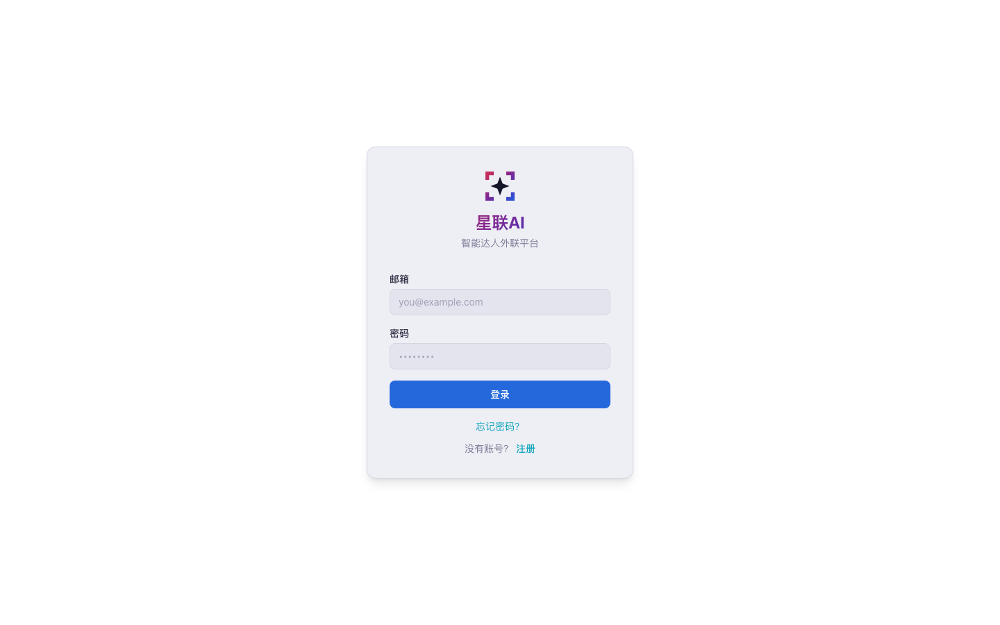
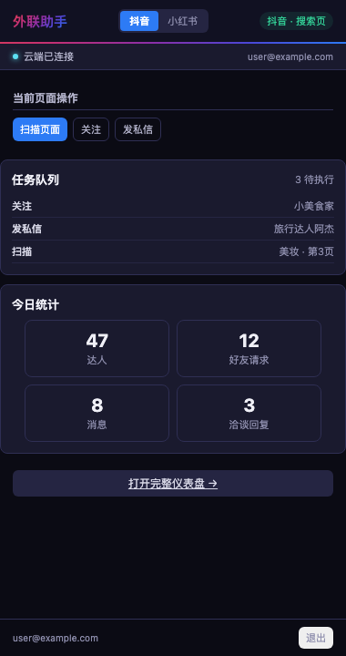
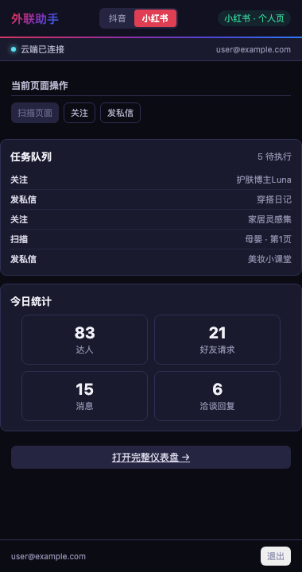

# XingLian AI (星联AI) — Influencer Outreach Platform

**The zero-to-one, all-in-one workspace for influencer outreach on Douyin and Xiaohongshu.**

XingLian AI is a complete outreach operating system — not just another CRM or messaging tool. It covers every stage of the influencer collaboration lifecycle: from brainstorming campaign strategy and organizing creator lists, to AI-powered prospect scoring, personalized mass outreach, and negotiation management. Think of it as the workspace where your entire outreach operation lives.

<p align="center">
  
</p>

---

## Why XingLian AI?

Most outreach tools solve one piece of the puzzle — a spreadsheet here, a messaging bot there. XingLian AI was built from scratch as an **end-to-end platform** that replaces the patchwork:

- **No more tab-juggling.** The Chrome extension lives in your browser's side panel, overlaying Douyin and Xiaohongshu natively. Scan, follow, and DM creators without leaving the platform.
- **No more copy-pasting.** AI drafts personalized messages for each creator based on their profile, content style, and your campaign goals.
- **No more guesswork.** AI-powered prospect scoring ranks creators by engagement quality and brand fit so you focus on high-value partnerships.
- **No more spreadsheet chaos.** A centralized web dashboard tracks every prospect, message, and negotiation in one place — with real-time sync from the extension.

---

## How It Works

XingLian AI has two connected surfaces: a **Chrome extension** for on-platform actions and a **web dashboard** for strategy and management.

### Chrome Extension — Your On-Platform Control Center

The extension lives in Chrome's side panel and connects directly to Douyin and Xiaohongshu. It detects what page you're on and surfaces the right actions.

<p align="center">
  
  &nbsp;&nbsp;&nbsp;&nbsp;
  
</p>
<p align="center">
  <em>Left: Douyin search page scan &nbsp;|&nbsp; Right: Xiaohongshu profile actions</em>
</p>

**What it does:**

| Action | Description |
|--------|-------------|
| **Scan Page** | Extract all creators from a search results or discover page in one click. Filters out institutions automatically. |
| **Follow** | One-click follow on any creator's profile page. |
| **Send DM** | Send a personalized (or AI-drafted) direct message from a profile or chat page. |
| **Task Queue** | View and manage pending automation actions — follows, DMs, and scans execute in sequence with human-like delays. |
| **Live Stats** | Track today's outreach numbers at a glance: prospects found, follows sent, messages delivered, negotiations replied. |

### Web Dashboard — Your Outreach Command Center

The full web dashboard at [outreach-hub-lac.vercel.app](https://outreach-hub-lac.vercel.app) is where strategy meets execution:

- **Prospect Pipeline** — View, filter, and manage all discovered creators across both platforms.
- **AI Scoring** — Automatically rank prospects by engagement rate, follower quality, and campaign fit.
- **Message Templates** — AI-generated, personalized outreach messages ready to send.
- **Negotiation Tracker** — Monitor ongoing conversations and get AI-suggested replies.
- **Activity Log** — Full audit trail of every action taken by the extension.
- **Quota Management** — Built-in daily rate limits to keep your accounts safe.

---

## The All-in-One Workflow

XingLian AI isn't just an outreach tool — it's the workspace where your entire influencer operation runs:

```
 Campaign Planning          Discovery & Research         Outreach & Negotiation
┌─────────────────┐     ┌──────────────────────┐     ┌─────────────────────────┐
│  Define goals    │     │  Scan Douyin/XHS     │     │  AI-drafted messages    │
│  Set criteria    │ ──▶ │  AI scores creators  │ ──▶ │  Automated follow/DM    │
│  Organize lists  │     │  Filter & rank       │     │  Negotiation replies    │
│  Plan campaigns  │     │  Build pipeline      │     │  Track conversations    │
└─────────────────┘     └──────────────────────┘     └─────────────────────────┘
```

---

## Tech Stack

| Layer | Technology |
|-------|-----------|
| **Extension** | Chrome Manifest V3, vanilla JS, CSS (dark mode) |
| **Web Dashboard** | Next.js, Vercel |
| **Backend** | Supabase (PostgreSQL + Auth + Realtime) |
| **AI** | Claude API for scoring, message drafting, and negotiation |
| **Platforms** | Douyin (抖音), Xiaohongshu (小红书) |

---

## Architecture

```
┌──────────────────────────────────────────────────────────────┐
│                     Chrome Extension                         │
│  ┌─────────┐   ┌──────────────┐   ┌───────────────────────┐ │
│  │ Side    │   │  Background  │   │  Content Scripts       │ │
│  │ Panel   │◄─▶│  Service     │◄─▶│  ├─ douyin/           │ │
│  │ (UI)    │   │  Worker      │   │  │  ├─ extractors.js   │ │
│  │         │   │  (routing,   │   │  │  └─ actions.js      │ │
│  │         │   │   polling)   │   │  └─ xiaohongshu/       │ │
│  │         │   │              │   │     ├─ extractors.js   │ │
│  │         │   │              │   │     └─ actions.js      │ │
│  └─────────┘   └──────┬───────┘   └───────────────────────┘ │
│                        │                                     │
└────────────────────────┼─────────────────────────────────────┘
                         │  REST API
                         ▼
               ┌─────────────────┐
               │  Vercel (API)   │
               │  + Supabase     │
               │  + Claude AI    │
               └─────────────────┘
                         ▲
                         │
               ┌─────────────────┐
               │  Web Dashboard  │
               │  (Next.js)      │
               └─────────────────┘
```

---

## Key Design Decisions

- **Selector-agnostic extraction** — Douyin and XHS update their DOM constantly. The extension uses `data-e2e` attributes, text pattern matching, and class-based selectors as layered fallbacks so extraction doesn't break on every platform update.
- **React fiber injection** — For Douyin (a React app), the extension triggers native React `onClick` handlers through the fiber tree rather than simulating DOM events, which is more reliable.
- **Human-like behavior** — Randomized delays, natural scroll patterns, and server-enforced daily quotas keep your accounts safe from detection.
- **Background tab scanning** — Auto-scans run in background tabs so they never interrupt your workflow.

---

## Installation

1. Clone this repository
2. Open `chrome://extensions` in Chrome
3. Enable **Developer mode** (toggle in the top right)
4. Click **Load unpacked** and select the project folder
5. The extension icon appears in your toolbar — click it to open the side panel
6. Log in with your XingLian AI account (or sign up at the web dashboard)

> PDF installation guides are included in both [English](Installation_Guide.pdf) and [中文](安装指南.pdf).

---

## License

MIT
